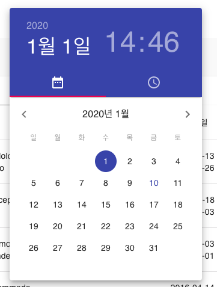
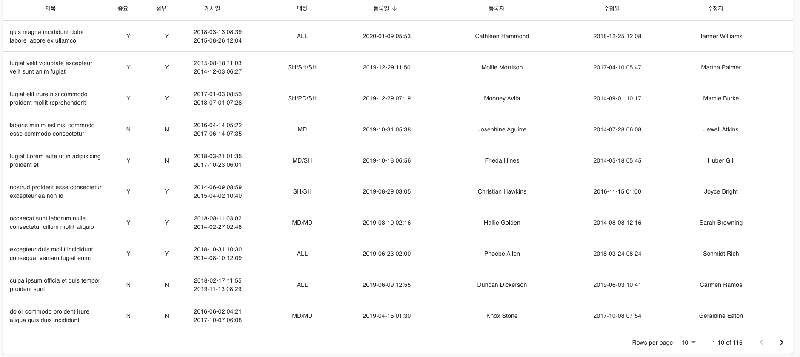

# MATERIAL-COMPONENTS

ReactJS + MaterialUI 기반에서 동작합니다. 

기본으로 제공되는 component를 변경하였습니다.

## Datepicker

기존 datepicker에서 달력에 표시되는 포멧을 한글로 변경하고 삭제 등의 기능을 추가 하였습니다.



App.js에서 포멧이나 타임존에 대한 변경을 할수 있습니다.

> 주의 할점은 @date-io/moment 2.X에서는 오류가 발생합니다. 1.3.x를 사용해주세요.

```
// for MuiPickers only
MomentUtils.prototype.getCalendarHeaderText = date => {
  return MomentUtils.prototype.format(date, 'YYYY년 M월');
};
MomentUtils.prototype.getDateTimePickerHeaderText = date => {
  return MomentUtils.prototype.format(date, "M월 D일");
};
```

## DataTable

기본 테이블에 정렬기능을 추가 하였습니다.

복잡하지 않고 정렬만 사용할 경우 유용합니다.

정렬되고 있는 컬럼에 정렬방식을 표기하고 다시 클릭하면 반대로 정렬합니다.



